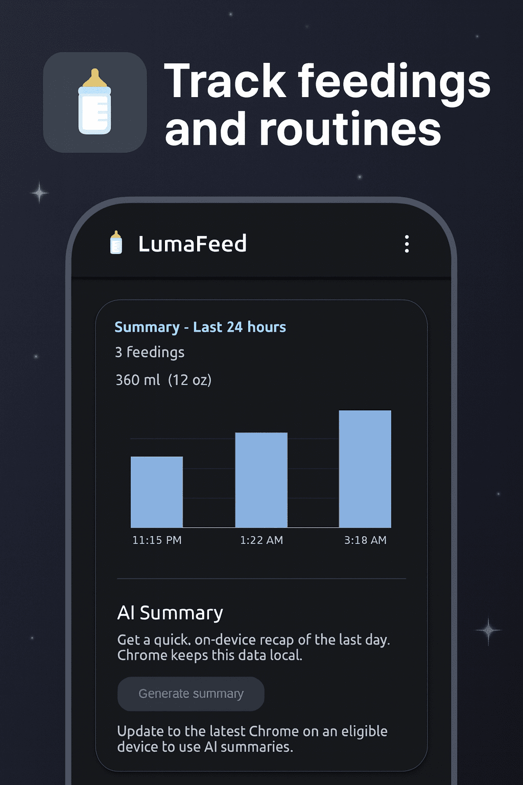
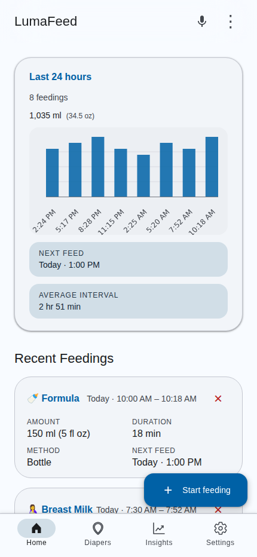
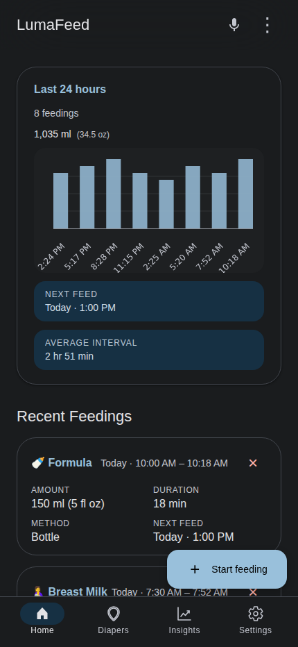
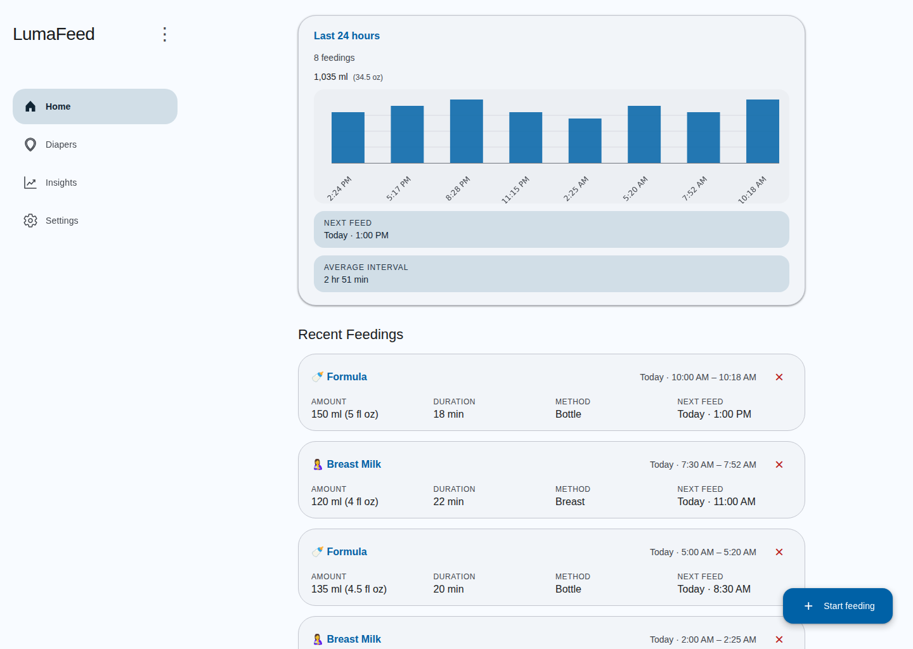
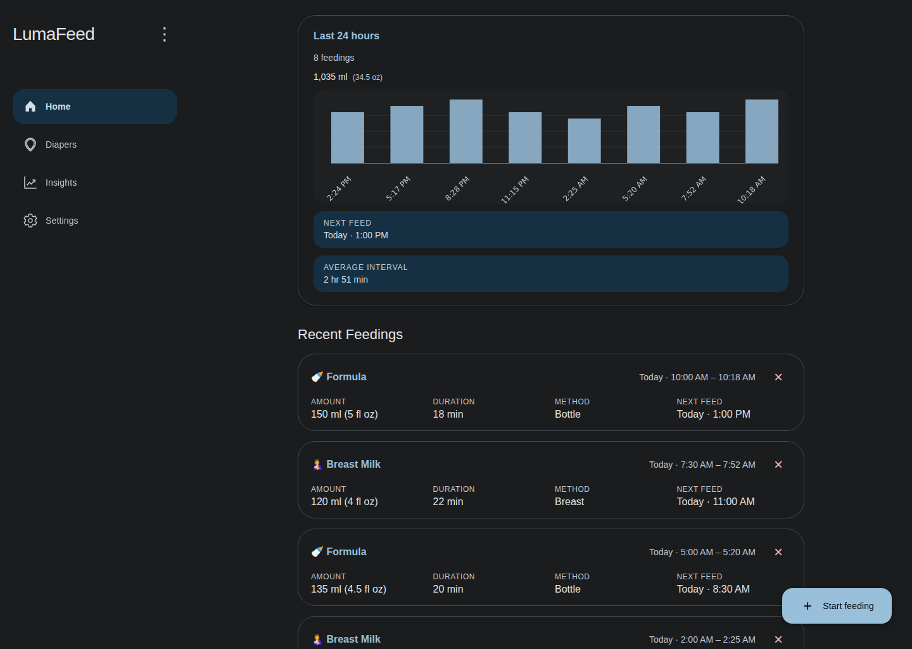

# LumaFeed

The everyday companion for caregivers who want quick, reliable answers about the last feeding, the next feeding, and everything in between.

## Why LumaFeed exists

- Make feeding records effortless so you can focus on your baby, not spreadsheets.
- Give every caregiver the same up-to-date picture: nursing, bottle, pumped milk, and formula all live in one place.
- Surface the next-feed window automatically so you can plan naps, errands, and bedtime with confidence.

## What you can track

- Start and end times for each feeding session, including duration.
- Amounts across units (oz or ml) with automatic conversions when you switch.
- Notes for anything you want to remember: which side, pumping context, how baby responded, and more.
- Upcoming feeds thanks to smart reminders that use your preferred schedule.

## How LumaFeed helps every day

- **In the moment**: Start a timer with one tap, pause if you need to swap sides, and finish without breaking your rhythm.
- **Later that night**: Scroll a clean log of the day, spot trends, and capture those “did we feed at 2 or 3?” questions instantly.
- **Sharing shifts**: Invite partners, grandparents, or night nurses to use the same tracker so handoffs stay smooth.
- **On the go**: Works offline, then syncs when you reconnect, so even travel days stay accurate.
- **Peace of mind**: Everything, including the optional AI summaries, runs entirely on your device so nothing leaves your hands.

## See LumaFeed in action

## Quick start for caregivers

1. Install the app on your phone or tablet from your browser’s “Add to Home Screen” prompt.
2. Open the timer when you begin a feeding; log manually if you prefer to enter details afterward.
3. Check the dashboard after each session to see the projected next feeding and make notes while details are fresh.
4. Visit Settings to tune your preferred feeding interval, default units, and notification style.

## Answers to common questions

- **Does it work offline?** Yes. Start or edit logs without a connection; everything syncs once you are back online.
- **Will it remind me?** LumaFeed highlights the next expected feeding based on the schedule you set and can surface gentle nudges if you enable notifications.
- **Can more than one person use it?** Absolutely. Share the same device or install LumaFeed on multiple devices and sign in with the same profile.
- **Do I need an account?** LumaFeed stores data on your device first. You can export logs whenever you like or pair with cloud storage for backups.

## Your data, your rules

- All data stays on your device, always.
- Built-in AI summaries use a local model running on your device, so feeding details never leave your device.

## Need help or want to share feedback?

- File an issue or feature request on GitHub.
- Email the maintainers at support@lumafeed.com.
- Join our changelog newsletter to hear about new features.

## For contributors

LumaFeed is an open-source Progressive Web App built with Lit web components. If you want to help improve the experience:

- Install dependencies: `npm install`
- Run the local dev server: `npm run dev`
- Execute type checks: `npm run type-check`
- Launch tests: `npm test`

See `src/app-root.ts` and `src/pages/home-page.ts` for the core experience and review `.github/copilot-instructions.md` for architectural guidance.

## License

MIT
